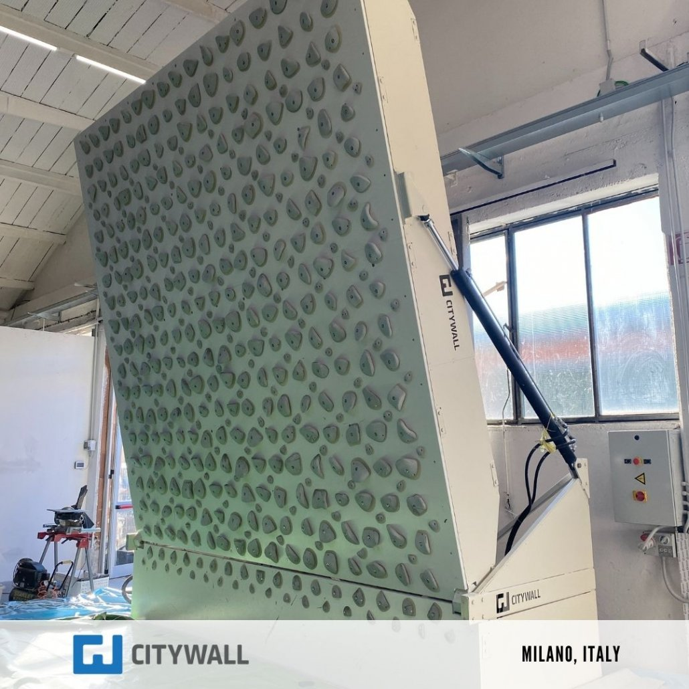

# Mur-interactif

# Mise en context
> Dans le cadre du lancement d'un  nouveau filme intitulé "Free Solo" produit par Netflix, j'ai comme mission de créé une instalation interactive qui aura pour but d'immerger
> le participant dans l'univers du film.

https://www.youtube.com/watch?v=urRVZ4SW7WU&t=119s

# Introduction
L'instalation interactive sera une immersion d'escalade interactive avec le grimpeur pour simuler certain passsage du film.

(developpement

1. techno qui existent deja pour créé le mur (moon board) + defi technique pour le mur(mur transparent)
2. autre composant immersif pour augmenter la sensation vent, son
3. ce qui pourraitr ressembler au résultas final (maquette)

# Les technologie qui existent déja en terme d'escalade interactive
  
  ### Le Moonboard
     
      

