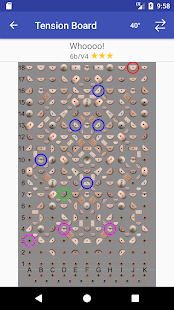
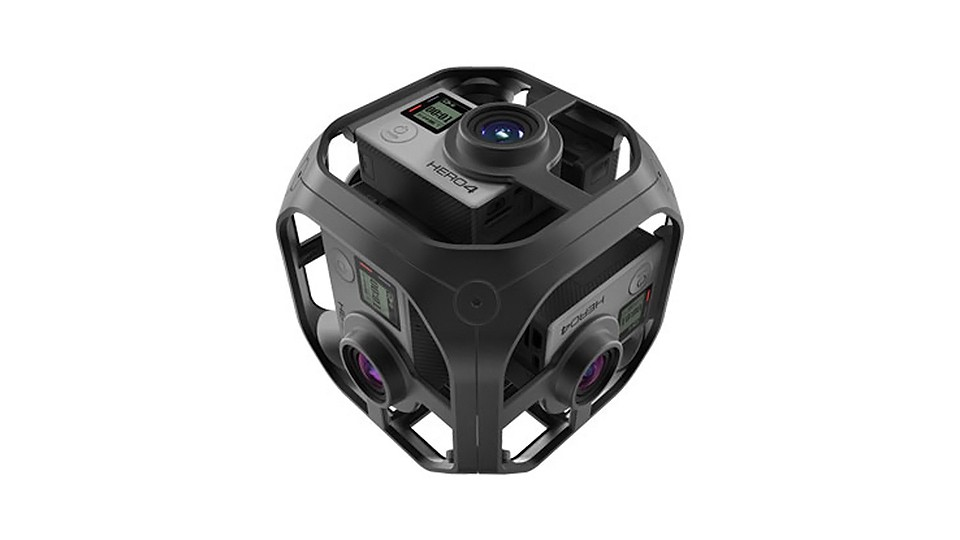
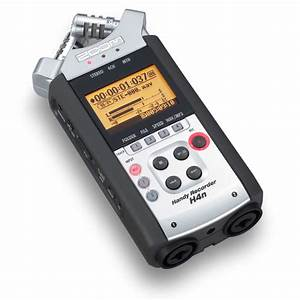
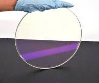
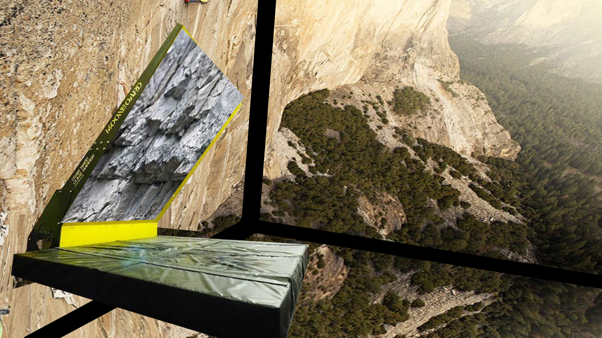

# Mur-interactif

# Mise en context
> Dans le cadre du lancement d'un  nouveau filme intitulé "Free Solo" produit par Netflix, je doid créé une instalation interactive qui aura pour but d'immerger
> le participant dans l'univers du film.

https://user-images.githubusercontent.com/93718079/145319285-3202263e-dbae-4633-8841-23feb78d1100.mp4

# Introduction
Pour parvenir a cela je vais créer un experience immersive qui stimulera le participant avec de l'activité physique, avec des projections et des sons ambiants.

1. techno qui existent deja pour créé le mur (moon board) 
2. autre composant immersif pour augmenter la sensation, son, image/projection
3. ce qui pourraitr ressembler au résultas final (maquette)

# Les technologie qui existent déja en terme d'escalade interactive
  
  ## Le Moonboard

| le moonboard |  L'application |
| ----------- | ----------- |
|  | |
| Mur d'escalade standardisé avec reglage d'angle  | application avec base de donné pour voie d'escalade  |

### Composant intéressant a propos de celui-ci
1. peut être controler à partir d'un téléphone par connexion bluetooth avec l'application supporté par le mur
2. réglage d'inclinaison déja intégré à la structure
3. relativement compact comparé à un vrai mur d'escalade
4. permet de grimper sans harnais pour recréer l'aspect de ne pas être attacher comme dans le film

## Les autres composants (son et image et projection)
  Pour projeter les images il faut commencer par les capter. Donc il sera necessaire d'avoir une équipe sur le terrain avec de l'equipement pour capter des videos en 360 des       lieux. Cette equipe va aussi devoir enregistrer des son ambiant.
  
   
 | Assamblage de Gopro |  zoom H4N |
| ----------- | ----------- |
|  | |
| Puisque ce sont des conditions dificile pour capter des images, les Gopros offrent un format compact  | Pour la même raison le Zoom H4N est petit et avec les conditions il sera idéal.  |

### Projection sur les murs, le plafond et le plancher
  Suite à la captation des different médias, pour les prejeter il devra y avoir 6 projecteurs pour projeter sur les 4 murs ainsi que sur le plafond et le plancher.
  
 ### Projection sur le mur d'escalade
 Comparé aux projections sur les murs, la projection sur la paroie d'escalade à un défi de plus. Puisqu'un participant va grimper sur le mur le projecteur doit provenir du dos de la paroie pour ne pas créer d'ombrage et briser l'immersion du participant. Pour parvenir à ceci il existe un matériel nommé le spinel. Il est tranparent dont en lui ajoutant une pelicule pour le rendre plus opaque il va pouvoir reflecter l'image du projecteur au participant sans être altérer par le partcipant.
 
 
 
 
 le spinel est considéré plus solide que l'acier et est utilisé par l'armée américaine pour les armure léger.
 
 ## Maquette de l'instalation
  
 

# bibliographie
https://www.rtflash.fr/spinel-nouveau-materiau-transparent-plus-dur-que-l-acier/article

